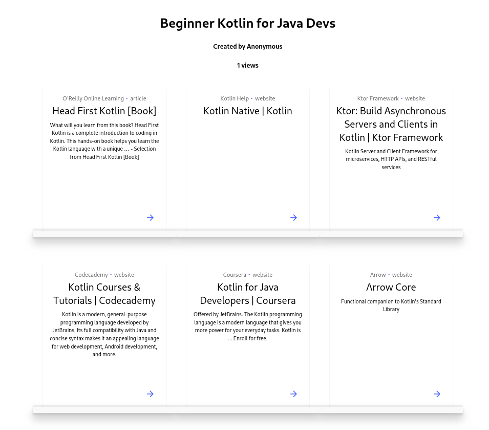

<p align="center">
  
</p>

[Shelf.gg](https://shelf.gg/) is a pastebin that makes it easier to find and share resources.

## Usage

### What is a shelf?

A group of related resources (currently limited to URLs).

### How do I create a shelf?

Head to the [build page](https://shelf.gg/build), (optionally) enter a title and creator for your shelf, and provide one or more URLs to be included. This will build a shelf similar to:

<p align="center">
  
</p>

### How can I explore shelves?

Head to the [explore page](https://shelf.gg/explore) where you can sort, filter, and search your way through all public shelves.

## Development

### Client

To get setup the shelf.gg client locally:

```bash
git clone https://github.com/samueldobbie/shelf.gg
cd shelf.gg
yarn install && yarn start
```

### Meta data API

Shelf.gg has a basic API for parsing meta data from URLs that can be run locally using:

```bash
git clone https://github.com/samueldobbie/shelf.gg
cd shelf.gg/api
virtualenv -p python3.9.9 .venv
source .venv/bin/activate
pip3 install -r requirements.txt
flask run
```

### Firebase

Shelf.gg uses Firebase, which you'll need to emulate during development:

1. Install the [Firebase CLI](https://firebase.google.com/docs/cli)
1. Start the [Firebase Emulators](https://firebase.google.com/docs/emulator-suite):

    `firebase emulators:start`

## Roadmap

- [x] Search through published shelves
- [ ] Delete a shelf / set an expiry date
- [ ] Set shelf visibility (public / private)
- [ ] Upload local docs (pdfs, images, etc.)
