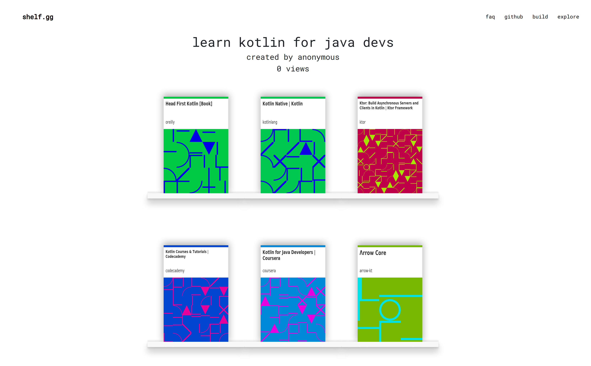

# shelf.gg

An easy way to share and find resources.

## Demo

Available at [shelf.gg](https://shelf.gg)

## Local

To setup locally, run `docker-compose up` in the root directory.

## Future

- Search through shelves
- Upload local docs (pdfs, images, etc.)
- Delete a shelf / set an expiry date
- Set shelf visibility (public / private)
